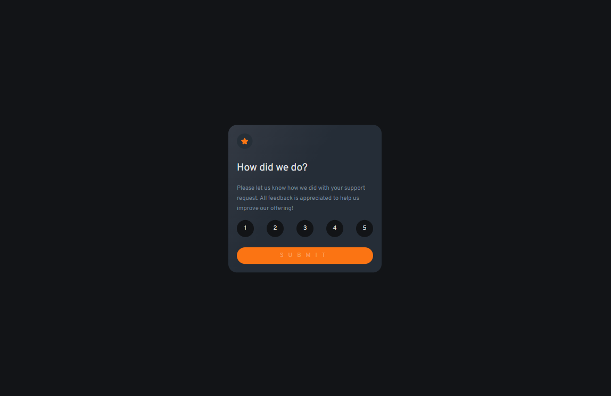

# Frontend Mentor - Interactive rating component solution

This is a solution to the [Interactive rating component challenge on Frontend Mentor](https://www.frontendmentor.io/challenges/interactive-rating-component-koxpeBUmI). Frontend Mentor challenges help you improve your coding skills by building realistic projects.

## Table of contents

- [Overview](#overview)
  - [The challenge](#the-challenge)
  - [Screenshot](#screenshot)
  - [Links](#links)
- [My process](#my-process)
  - [Built with](#built-with)
  - [What I learned](#what-i-learned)
  - [Continued development](#continued-development)
  - [Useful resources](#useful-resources)
- [Author](#author)
- [Acknowledgments](#acknowledgments)

## Overview

### The challenge

Users should be able to:

- View the optimal layout for the app depending on their device's screen size
- See hover states for all interactive elements on the page
- Select and submit a number rating
- See the "Thank you" card state after submitting a rating

### Screenshot

### Links

- Solution URL: [solution URL](https://github.com/nayabatir1/Interactive-rating-component)
- Live Site URL: [live site URL](https://nayabatir1.github.io/Interactive-rating-component/)

## My process

### Built with

- Semantic HTML5 markup
- CSS custom properties
- Flexbox
- CSS Grid
- Mobile-first workflow
- [React](https://reactjs.org/) - JS library

### What I learned

I recapped about react state. How react update DOM when state changes

### Continued development

I want to further improve react hook concept. How DOM re-render is triggered.

### Useful resources

- [Vite Guide](https://vitejs.dev/guide/) - This is an alternate to create-react-app.
- [React Hooks](https://reactjs.org/docs/hooks-intro.html) - This article introduces to react hooks and how it works.

## Author

- Website - [Atir Nayab](https://www.your-site.com)
- Frontend Mentor - [@nayabatir1](https://www.frontendmentor.io/profile/nayabatir1)
- Twitter - [@nayabatir1](https://www.twitter.com/nayabatir1)

## Acknowledgments

This is where you can give a hat tip to anyone who helped you out on this project. Perhaps you worked in a team or got some inspiration from someone else's solution. This is the perfect place to give them some credit.

**Note: Delete this note and edit this section's content as necessary. If you completed this challenge by yourself, feel free to delete this section entirely.**
